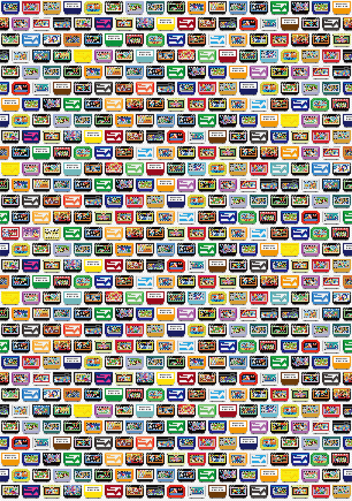

<html lang="en">
<head><link rel="stylesheet" href="style.css">

    <meta charset="UTF-8">
    <meta name="viewport" content="width=device-width, initial-scale=1.0">
    <title>Discover Tej</title>
    <link rel="stylesheet" href="style.css">
</head>

<body>
    <header>
        <h1>Discover Tej</h1>
    </header>
    <nav>
        <a href="#">Home</a> | <a href="#">About</a> | <a href="#">Projects</a> | <a href="#">Contact</a>
    </nav>
    <main class="container">
        <h2>Welcome to My Retro Macintosh Themed Site</h2>
        
This is a sample paragraph. Add your content here.

        
    </main>
    <footer>
        
&copy; 2024 Discover Tej

    </footer>
</body>
</html>
